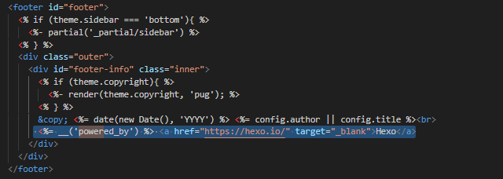

## 使用技巧

## 修改站点网页分享链接为github站点url

修改Hexo工程根目录下_config.yml文件中url为 GitHub Page URL

```
url: https://dllmayday.github.io/
```
<!--more-->

## 自定义文章生成模板

修改scaffolds目录下post.md（page/draft可根据平时用哪个创建进行修改，一般用post创建文章）
可按双斜杠后对应标签说明进行添加(*post保存时需删除注释文字*)
```
---
title: {{ title }}
date: {{ date }}
permalink:          //文章显示连接
categories:         //文章匪类目录
tags:             //文章标签，可多个，用，隔开
description:        //文章描述
image:              //自定义的文章摘要图片，只在页面展示，文章内消失
copyright: true     //增加底部的版权信息（需要配置）
---
 //首页文章展示缩略图


0x00 前言


<!--more-->
//正文
## 0x01 

## 0x02

## 0x03

## 0x04

<hr />
版权信息
```
## 父子分类
new post front-matter按如下添加
技术分享为父分类
Hexo为子分类
```
categories: 
- 技术分享
- Hexo
```
页面显示如下:


# 隐藏网页底部 powered By Hexo

去对应使用主题themes/landscape/layout/_partial/查找文件footer.ejs，删除powered_by所在行行




# 使用github issue存放评论


<script src="https://utteranc.es/client.js"
        repo="https://github.com/dllmayday/dllmayday.github.io"
        issue-term="pathname"
        theme="github-light"
        crossorigin="anonymous"
        async>
</script>