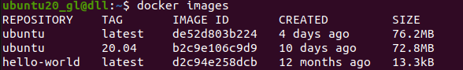
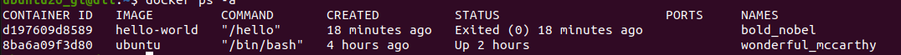

**官方地址：[Docker](https://www.docker.com/)**

## ubuntu20.04 安装步骤

 [参考地址](https://docs.docker.com/engine/install/ubuntu/#install-using-the-repository)

<!--more-->

 1. 设置apt 仓库安装 

 ```
 # Add Docker's official GPG key:
sudo apt-get update
sudo apt-get install ca-certificates curl
sudo install -m 0755 -d /etc/apt/keyrings
sudo curl -fsSL https://download.docker.com/linux/ubuntu/gpg -o /etc/apt/keyrings/docker.asc
sudo chmod a+r /etc/apt/keyrings/docker.asc

# Add the repository to Apt sources:
echo \
  "deb [arch=$(dpkg --print-architecture) signed-by=/etc/apt/keyrings/docker.asc] https://download.docker.com/linux/ubuntu \
  $(. /etc/os-release && echo "$VERSION_CODENAME") stable" | \
  sudo tee /etc/apt/sources.list.d/docker.list > /dev/null
sudo apt-get update
 ```
 2. 安装 Docker 软件包

```
sudo apt-get install docker-ce docker-ce-cli containerd.io docker-buildx-plugin docker-compose-plugin
```
 3. 通过运行镜像来验证Docker Engine安装是否成功 hello-world

 ```
 $ sudo docker run hello-world
 ```
 终端打印显示如下，则安装成功
 ```
 Unable to find image 'hello-world:latest' locally
latest: Pulling from library/hello-world
c1ec31eb5944: Pull complete 
Digest: sha256:a26bff933ddc26d5cdf7faa98b4ae1e3ec20c4985e6f87ac0973052224d24302
Status: Downloaded newer image for hello-world:latest

Hello from Docker!
This message shows that your installation appears to be working correctly.

To generate this message, Docker took the following steps:
 1. The Docker client contacted the Docker daemon.
 2. The Docker daemon pulled the "hello-world" image from the Docker Hub.
    (amd64)
 3. The Docker daemon created a new container from that image which runs the
    executable that produces the output you are currently reading.
 4. The Docker daemon streamed that output to the Docker client, which sent it
    to your terminal.

To try something more ambitious, you can run an Ubuntu container with:
 $ docker run -it ubuntu bash

Share images, automate workflows, and more with a free Docker ID:
 https://hub.docker.com/

For more examples and ideas, visit:
 https://docs.docker.com/get-started/

 ```
## Docker 安装拉取Ubuntu镜像

1. 查看可用的 Ubuntu 版本

访问 Ubuntu 镜像库地址： https://hub.docker.com/_/ubuntu?tab=tags&page=1。
可以通过 Sort by 查看其他版本的 Ubuntu。默认是最新版本 ubuntu:latest 。
2. 

拉取最新版的 Ubuntu 镜像
```
$ docker pull ubuntu
```
或者：
```
$ docker pull ubuntu:latest
```
拉取指定版本Ubuntu镜像
```
$ docker pull ubuntu:20.04
```
3. 查看本地镜像


4. 删除镜像 
```
docker rmi <容器名>
```

## Docker 容器使用

1. 创建容器

```
$ docker run -it --name my-ubuntu-container ubuntu /bin/bash
```
这里，-it 参数让Docker提供一个交互式终端，--name my-ubuntu-container 给你的容器命名为 my-ubuntu-container。

2. 查看所有的容器

```
$ docker ps -a
```


3. 启动容器

```
$ docker start <容器ID>    #启动已停止容器 
$ docker restart <容器 ID> #重启
```
### 后台启动运行
```
$ docker run -itd --name ubuntu-test ubuntu /bin/bash
```
4. 停止容器

```
$ docker stop <容器 ID>
```
5. 进入容器

```
docker attach  <容器 ID> #终端退出后容器停止
docker exec -it <容器 ID> /bin/bash   #终端退出，容器不会停止
```
6. 导入导出容器

```
$ docker export <容器 ID>  > ubuntu.tar   #导出容器
# 如果导出的是容器文件系统，可以创建一个新容器并从tar文件中导入文件系统：
docker import my_container.tar my_container_image
```
 保存容器镜像：
如果你想要迁移整个容器，包括其状态，你需要先创建一个镜像，然后保存为tar文件。
```
docker commit my_container my_container_image
docker save my_container_image > my_container_image.tar
# 在目标机器上，使用docker load命令加载镜像。
docker load < my_container_image.tar
```
7. 移除容器
```
$ docker rm  <容器ID>
```

## 组管理
#### 创建docker group
```
$ groups   #查看当前组，若不存在docker组则用如下命令创建docker组
$ sudo groupadd docker
```
### 增加当前系统用户到docker组
<span style="color:red">
**这一步设置非常重要，否则当前用户下执行命令行需要加sudo，VS Code配置Dock访问管理无法获取权限！！！**
</span>
```
 sudo usermod -aG docker $USER
```

<hr />
版权信息