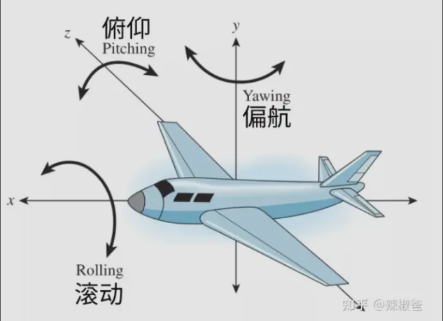
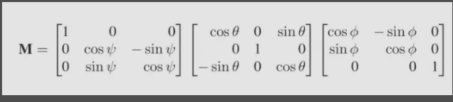

## 欧拉角

欧拉角是一种基于三种较简单旋转运动（称为俯仰、滚动和偏航）创建一般旋转的机制。如下图，一架沿x轴方向飞行的飞机可以通过转向左或转向右（偏航），朝上飞或朝下飞（俯仰），或简单绕x轴旋转（滚动）来改变飞行方向。

<!--more-->

可以看出俯仰、偏航、滚动分别就是绕z轴、y轴、x轴旋转，上面已经给出了这三种特殊旋转的旋转矩阵。这三个矩阵的乘积就可以用来表示一般旋转，图形学中最常使用的定义顺序是将欧拉角表示为(φ, θ, ψ)（说明：φ：滚动角，θ：偏航角，ψ：俯仰角），那么3D空间一般旋转矩阵M就可以表示为三个旋转矩阵的积：

M = Ryz(ψ)Rzx(θ)Rxy(φ)

代入前面三个旋转矩阵表示如下，我们无需计算具体的结果，就表示为乘积的形式即可，在实际使用中乘积是通过计算机来完成的。这三种旋转是相互独立的，使用这个一般矩阵可以表示3D空间中的任意旋转。

[原文地址](https://zhuanlan.zhihu.com/p/433131431)

版权信息