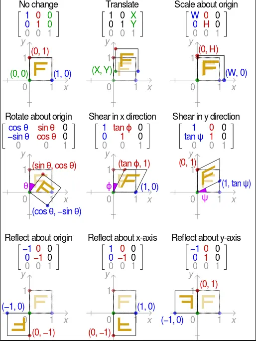

图像的几何变换主要包括：平移、旋转、缩放、剪切、仿射、透视等。
图像的几何变换主要分为：刚性变换、相似变换、仿射变换和透视变换（也称为投影变换）。
刚性变换：平移、旋转；
相似变换：缩放、剪切；
仿射变换：从一个二维坐标系变换到另一个二维坐标系的过程，属于线性变换。通过已知3对坐标点便可求取变换矩阵。
透视变换：从二维坐标系变换到三维坐标系，在从三维坐标系投影到二维平面，属于非线性变换。通过已知4对坐标点便可求取变换矩阵。

<!--more-->

一个集合 X XX 的仿射变换为：

*f(x)=Ax+b,x∈X*

它的几何意义是对一个图形进行：
缩放（Scale）、平移(translate)、旋转(rotate)、反射（reflection, 对图形照镜子）、错切(shear mapping，感觉像是一个图形的倒影)

或者它们的任意组合

（Ax 加上向量 b，相当于对Ax平移）

维基百科中的一个图很好诠释了各种仿射变换：

仿射变换中集合中的一些性质保持不变：
（1）凸性
（2）共线性：若几个点变换前在一条线上，则仿射变换后仍然在一条线上
（3）平行性：若两条线变换前平行，则变换后仍然平行
（4）共线比例不变性：变换前一条线上两条线段的比例，在变换后比例仍然步

注：所有的三角形都能通过仿射变化为其他三角形，所有平行四边形也能仿射变换为另一个平行四边形。

版权信息