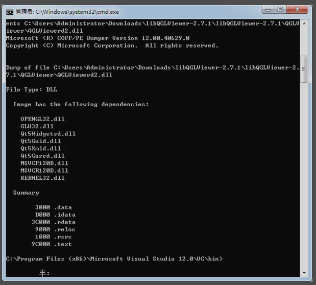
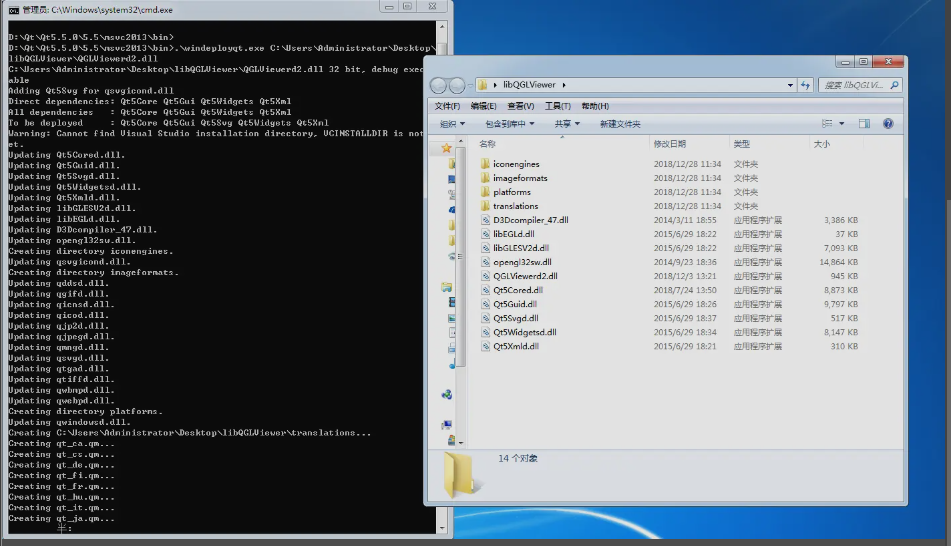

如果安装了VS，可以用VS下自带的一个命令行工具：dumpbin.exe

我的路径为：C:\Program Files (x86)\Microsoft Visual Studio 12.0\VC\bin
打开cmd.exe，cd到该路径后，输入：

.\dumpbin -dependents xx.dll （全路径）
或
.\dumpbin \dependents xx.exe （全路径）

<!--more-->

我的程序是Qt程序,Qt环境自带查找依赖工具
定位到Qt环境D:\Qt\Qt5.5.0\5.5\msvc2013\bin(看自己的安装路径)下找到windeployqt.exe

命令行执行：
.\windeployqt.exe xx.exe （全路径）
此时会自动将所需的类库、文件等拷贝到程序或库所在路径下

版权信息